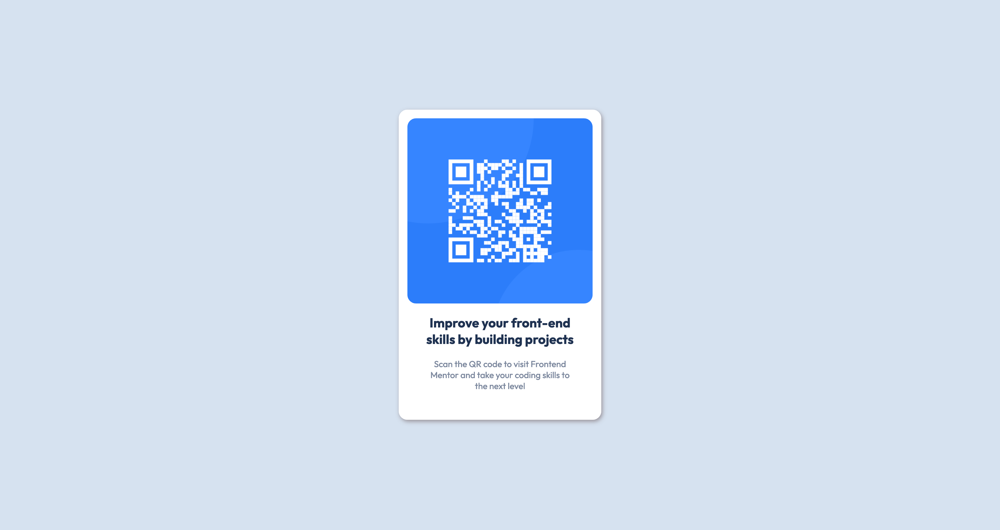

# Frontend Mentor - QR code component solution

This is a solution to the [QR code component challenge on Frontend Mentor](https://www.frontendmentor.io/challenges/qr-code-component-iux_sIO_H). Frontend Mentor challenges help you improve your coding skills by building realistic projects. 

## Table of contents

- [Overview](#overview)
  - [Screenshot](#screenshot)
  - [Links](#links)
- [My process](#my-process)
  - [Built with](#built-with)
  - [What I learned](#what-i-learned)
- [Author](#author)

## Overview

### Screenshot

### Links

- Solution URL: (https://github.com/fvreede/qr-code-compnent-with-html-and-css)
- Live Site URL: (https://qr-code-component-html-css.netlify.app)

## My process

### Built with

- HTML
- CSS
- Flexbox
- Mobile-first approach

### What I learned

I have learned how to work with Flexbox and I transformed designs to code using my keen eye for detail which was fun and complex to do.

## Author

- GitHub - [Fabio Vreede](https://www.github.com/fvreede)
- Frontend Mentor - [@fvreede](https://www.frontendmentor.io/profile/fvreede)
